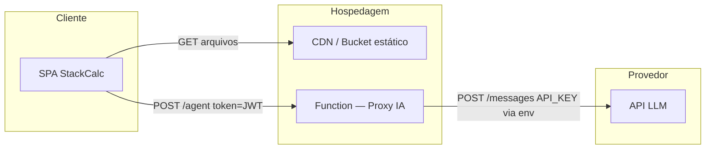

# Arquitetura do Sistema — StackCalc MVP

**Versão**: 0.1
**Data**: 2026-03-30
**Decisão de proxy**: ver [ADR-001](../adr/ADR-001-proxy-llm.md)

---

## 1. Visão geral

O StackCalc MVP é composto por três camadas:

```
┌─────────────────────────────────────────────────────────┐
│                      CLIENTE                            │
│   Browser  →  SPA estática (HTML / CSS / JS)            │
│               - 5 abas da calculadora                   │
│               - painel de resumo                        │
│               - interface do Agente                     │
└────────────────────────┬────────────────────────────────┘
                         │ HTTPS
        ┌────────────────┴──────────────────┐
        │                                   │
        ▼                                   ▼
┌───────────────┐                 ┌──────────────────────┐
│  CDN / Bucket │                 │  Function (Proxy IA) │
│  (arquivos    │                 │  - valida token      │
│   estáticos)  │                 │  - rate limit        │
└───────────────┘                 │  - injeta API key    │
                                  │  - chama LLM         │
                                  └──────────┬───────────┘
                                             │ HTTPS
                                             ▼
                                  ┌──────────────────────┐
                                  │  Provedor LLM        │
                                  │  (ex.: Anthropic     │
                                  │   Claude API)        │
                                  └──────────────────────┘
```

### Diagrama Mermaid



---

## 2. Componentes

### 2.1 SPA estática

| Atributo | Valor |
|---------|-------|
| Tecnologia atual | HTML + CSS + JavaScript vanilla |
| Build step | Nenhum (MVP); migração futura para Vite + TypeScript se complexidade crescer |
| Estado | Mantido no browser (`sessionStorage` / `localStorage`); sem banco de dados |
| Hospedagem | CDN (Cloudflare Pages, Netlify, GitHub Pages ou S3+CloudFront) |
| Chave de API | **Nunca** no front — somente no proxy |

**Módulos principais da SPA:**

- `index.html` — estrutura e abas
- `styles.css` — tokens de design (`:root`), layout, temas
- `app.js` — orquestração das abas, estado da sessão, chamada ao proxy
- `stackcalc.js` — lógica de cálculo (paridade com planilha v2.0)

### 2.2 Function / Proxy IA

| Atributo | Valor |
|---------|-------|
| Tecnologia | Cloudflare Worker **ou** Vercel Function **ou** Netlify Function (uma opção — ver ADR-001) |
| Runtime | Node.js / Edge runtime |
| Autenticação | Valida JWT assinado com `TOKEN_SECRET` |
| Rate limit | `RATE_LIMIT_RPM` requisições por usuário por mês (contagem em KV / store do provedor) |
| Secrets | `LLM_API_KEY`, `LLM_MODEL`, `TOKEN_SECRET` — somente em variáveis de ambiente do provedor |
| Payload enviado ao LLM | Dados de negócio da sessão (classificação, scores, riscos marcados); **sem** dados pessoais identificáveis |

**Fluxo de uma requisição ao Agente:**

```
Browser
  │  POST /agent
  │  Authorization: Bearer <JWT>
  │  Body: { classificacao, scoreEscopo, riscosChecados, tipoAnalise }
  ▼
Proxy Function
  ├─ Verificar assinatura do JWT (TOKEN_SECRET)
  ├─ Verificar quota do usuário (rate limit)
  ├─ Construir prompt com dados de negócio
  ├─ POST LLM API (injetando LLM_API_KEY via env)
  └─ Retornar { texto } ao browser
```

### 2.3 Provedor LLM

- **Modelo recomendado para MVP**: `claude-haiku-4-5-20251001` (menor custo para iteração) ou `claude-sonnet-4-6` (qualidade melhor para defesa técnica).
- **Alternativa**: OpenAI GPT-4o-mini (verificar custo comparativo).
- A escolha do modelo é configurável via `LLM_MODEL` — sem alterar código.

---

## 3. Fluxo de dados

### 3.1 Dados que saem do browser para o proxy

```json
{
  "tipoAnalise": "defesa_tecnica | mapa_riscos",
  "classificacao": "Médio",
  "scoreEscopo": 72,
  "horasTotal": 320,
  "riscosChecados": ["Dependências externas", "Prazo agressivo"],
  "contextoAdicional": "<texto livre do usuário, máx. 500 chars>"
}
```

**O que NÃO deve sair do browser para o proxy:**
- Nome completo do usuário
- E-mail
- Dados de pagamento
- Conteúdo de código-fonte do projeto do usuário

### 3.2 Prompt construído pelo proxy

O proxy monta o prompt no servidor, nunca no browser. Estrutura mínima:

```
Sistema: Você é o Agente StackCalc. Analise a estimativa a seguir e gere [tipo de análise].
Dados: {classificação, score, horas, riscos}
Instrução: Gere [defesa técnica / mapa de riscos] em português, tom profissional, máx. 400 palavras.
```

### 3.3 Resposta ao browser

```json
{
  "texto": "...",
  "modelo": "claude-haiku-...",
  "tokensUsados": 312
}
```

---

## 4. Limites de responsabilidade

| Camada | Responsável por | Não responsável por |
|--------|----------------|---------------------|
| SPA | Cálculos de estimativa, UX, estado local | Guardar chaves, persistência na nuvem |
| Proxy | Autenticação, rate limit, segredo da chave LLM | Lógica de negócio da calculadora |
| LLM | Geração de texto | Correção dos cálculos, garantia de paridade |

---

## 5. Decisões de arquitetura

| Decisão | Documento |
|---------|-----------|
| Proxy serverless vs. chave no browser | [ADR-001](../adr/ADR-001-proxy-llm.md) |
| Provedor de hospedagem (a definir) | ADR-002 (a criar após escolha) |
| Provedor LLM (a definir) | ADR-003 (a criar após escolha) |

---

## 6. Roadmap de evolução da arquitetura

| Fase | Mudança |
|------|---------|
| MVP (atual) | Front estático + proxy serverless; autenticação por lista de e-mails |
| Pós-MVP | Integração webhook Hotmart para provisionar tokens automaticamente |
| Futuro | Persistência de histórico (KV ou banco gerenciado); export PDF server-side |
